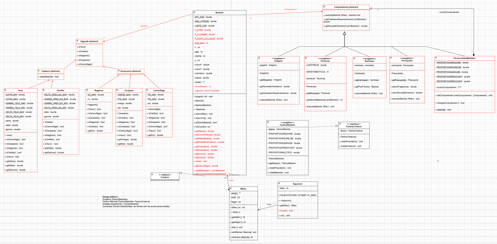

***Groupe 1 - Cpp***

# BE-Simulation d'un écosystème

## Introduction
Ce projet est une simulation d'un écosystème des bestioles dans un aquarium, visant à explorer et démontrer comment différentes créatures interagissent lorsqu'elles ont des capteurs, des accessoires et différents comportements. Le système simule divers comportements des bestioles : grégaire, peureuse, kamikaze, prévoyant et à personnalités multiples, tout en prenant en compte différents capteurs (comme les yeux et les oreilles) et accessoires (comme les nageoires, les carapaces et le camouflage).

## Description de la bestiole
Il existe deux façons pour la naissance d'une bestiole : la première est que le système peut les générer spontanément, la seconde est qu'elles peuvent être clonées à partir d'une bestiole déjà existante. Dès la naissance, chaque bestiole possède un attribut de durée de vie, et elle disparaîtra (mourra) lorsque ce temps sera terminé. De plus, lorsqu'une collision se produit entre deux bestioles, chacune d'elles a une certaine probabilité de mourir.

Pour s'adapter à l'écosystème, les bestioles ont évolué, par exemple en développant des capteurs, des accessoires et certains comportements spéciaux. Elles ont toutes chacun de ces attributs avec des paramètres aléatoirs (mais cela peut être changé dans le constructeur de Bestiole, en retirant l'ajoute de certains attributs dans la liste upgrades ou en le rendant aléatoire) 

Capteurs:
- Yeux: Les yeux permettent à la bestiole de voir un champ angulaire en face.
- Oreilles: Les oreilles permettent à la bestiole d’entendre tout autour d’elle.

Accessoires:
- Nageoires: Les nageoires permettent à la bestiole équipée, de se déplacer plus vite.
- Carapaces: Les bestiole avec carapace a plus de chances de survivre à une collision. Mais elles se déplacent moins vite.
- Camouflages: Une bestiole disposant d’un camouflage sera plus difficile à détecter par les autres bestioles.

Comportements:
- Grégaire : une bestiole dite grégaire ajuste sa direction sur la direction moyenne
des bestioles environnantes.
- Peureuse : lorsque le nombre de bestioles autour d’une bestiole dite peureuse
devient trop important, celle-ci fuit à vive allure dans la direction opposée avant de reprendre sa vitesse de croisière.
- Kamikaze : une bestiole dite kamikaze est attirée par la bestiole la plus proche et
tente de l’attaquer en cherchant à provoquer une collision.
- Prévoyante : une bestiole dite prévoyante estime les trajectoires des bestioles
autour d’elle et ajuste sa trajectoire pour éviter d’éventuelles collisions.
- À personnalités multiples : une bestiole dite à personnalités multiples adopte
successivement d’autres comportements choisis aléatoirement au cours du temps. Néanmoins, elle reste une bestiole à personnalités multiples.

## Diagramme de classe

## Design Pattern
Design patterns utilisés:
- Singleton (FactoryBestioles et les differents comportements (hors PresonnalitesMultiples))
- Factory Methode (FactoryBestioles / FactoryCreature)
- Strategy (Upgrades / Comportements)
- Composite (Comportement avec PersonnalitesMultiple, les feuilles sont les autres personnalités)

## Utilisation
1. **Cloner ce dépôt sur votre machine locale :**
	git clone https://github.com/badr4y/Bestioles.git
2. **Compilation avec makefile :**
	make
3. **Exécution du programme :** 
	./main
4. **Définir les paramètres:**
Définir la proportion des bestioles avec des comportements, et le nombre total des bestioles. Vous devrez entrer 6 valeurs pour démarrer le programme :
    1. Entrer la proportion de Grégaire :
    2. Entrer la proportion de Peureuse :
    3. Entrer la proportion de Kamikazi :
    4. Entrer la proportion de Prévoyant :
    5. Entrer la proportion de Multiple : 0
    6. Entrer la masse de population initiale :
- Attention : Toutes les valeurs de proportions doivent être comprises entre 0 et 1, et la masse de population initiale doit être entier. La somme des proportions doit être égales à 1.0 (sinon l'utilisateur s'expose à des bugs)
- Attention 2 : Les PersonnalitesMultiples ne sont pas stables. Il est conseillé de mettre 0 pour leur proportion car la simulation peut crash dans le cas contraire.

**Modifications supplémentaires**
Pour modifier les paramètres des accessoires tels que les yeux, les oreilles ou autres, veuillez directement accéder et modifier les valeurs correspondantes dans les fichiers .cpp appropriés. Par exemple, modifier la valeur de ALPHA_MAX (secteur angulaire maximal couvert par les yeux des bestioles) des Yeux dans Yeux.cpp.

## Enjoy the performance by bestioles
